# 🚀 Digi Complaint Box

> 🎯 A secure, student-friendly complaint management portal built with Django, empowering institutions to receive, track, and resolve issues transparently.

## 👨‍💻 Developers
- **Lead Developer**: [Atharva Nikam](https://github.com/Atharva654035)
- **Contributors**: [Shravani Naik](https://github.com/shravani211205)

## 🧠 Overview
`MiniProject/` orchestrates a full-stack workflow where students raise complaints, admins triage and resolve them, and both parties stay informed through in-app statuses and email alerts (`Home/views.py`, `Home/models.py`). Sensitive complaint content is encrypted at rest via the custom fields in `Home/encryption.py`, ensuring privacy even on shared infrastructure.

## 🌟 Key Features
- **Seamless student experience**: Guided signup/login, complaint submission with attachments, and instant status visibility (`OpeningPage.html`).
- **Smart admin operations**: Advanced filtering, search, and inline status updates in `AdminPanel.html`, plus audit trails through `ComplaintUpdate` logs.
- **Automated notifications**: Outbound emails on submission and resolution using Django’s email backend configured in `MiniProject/settings.py`.
- **PDF reporting**: Optional one-click export of complaint snapshots leveraging `reportlab` (`download_complaints_pdf()` in `Home/views.py`).
- **Encrypted records**: Personally identifiable information uses Fernet-based encryption (`EncryptedCharField`, `EncryptedTextField`).
- **Cloud-ready storage**: MySQL-compatible database configuration drawn from `.env`, enabling hosted deployments with minimal tweaks.

## 🏗️ Architecture & Tech Stack
- **Framework**: Django 5.2 (`manage.py`, `MiniProject/settings.py`).
- **Database**: MySQL-compatible service (Amazon RDS, Railway, Neon MySQL, etc.) accessed via `mysqlclient`.
- **Frontend**: Django templates augmented with Tailwind CDN for rapid styling (`Home/templates/`).
- **Security**: PBKDF2-derived encryption keys (Fernet), CSRF protection, role-based views (`@login_required`, staff gating).
- **Attachments**: Stored under `media/` with `FileField` paths configurable for cloud storage providers.

```mermaid
flowchart TD
    Student[Student 👩‍🎓] -->|Submit complaint| HomeView[Home.views.home]
    HomeView -->|Encrypt & persist| DB[(MySQL DB)]
    HomeView -->|Send email| SMTP[Email Backend]
    Admin[Admin 👨‍💼] -->|Log in| AdminLogin[Home.views.Admin_Login]
    AdminLogin --> AdminPanel[Home.views.Admin_Panel]
    AdminPanel -->|Updates & actions| DB
    AdminPanel -->|Notify student| SMTP
    PDF[Download PDF 📄] -->|Report| AdminPanel
```


## 📁 Project Structure
```text
Mini_Project/
├── manage.py
├── MiniProject/
│   ├── settings.py        # Core configuration, env-driven DB & email
│   └── urls.py            # URL routing for auth, admin panel, PDFs
├── Accounts/
│   └── models.py          # `StudentProfile` linked to Django auth
├── Home/
│   ├── models.py          # `Complaint`, `ComplaintCategory`, `ComplaintUpdate`
│   ├── views.py           # Student & admin flows, PDF export, emails
│   ├── templates/         # Login, signup, opening page, admin panel, modals
│   ├── encryption.py      # Custom encrypted model fields
│   └── migrations/        # Database schema history
├── media/                 # Uploaded complaint evidence & action images
├── Requirement.txt        # Python dependencies
└── README.md
```

## 🔑 Environment Variables
Store secrets in `.env` (loaded in `MiniProject/settings.py`). Minimum keys:

| Variable | Purpose | Example |
| --- | --- | --- |
| `DB_NAME` | Hosted MySQL database name | `digi_complaint` |
| `DB_USER` | Database username | `complaint_admin` |
| `DB_PASSWORD` | Database password | `super-secret` |
| `DB_HOST` | Database host endpoint | `containers-us-west-123.railway.app` |
| `DB_PORT` | Database port | `3306` |
| `ENCRYPTION_KEY` | 32+ char secret used to derive Fernet keys | `change-me-to-strong-secret` |
| `EMAIL_BACKEND` | Django email backend | `django.core.mail.backends.smtp.EmailBackend` |
| `EMAIL_HOST` | SMTP host | `smtp.gmail.com` |
| `EMAIL_PORT` | SMTP port | `587` |
| `EMAIL_USE_TLS` / `EMAIL_USE_SSL` | Booleans controlling transport | `True` / `False` |
| `EMAIL_HOST_USER` | Sender account | `notifications@example.com` |
| `EMAIL_HOST_PASSWORD` | Sender password or app key | `app-password` |
| `DEFAULT_FROM_EMAIL` | Friendly sender (fallback to host user) | `Digi Complaint Box <notifications@example.com>` |

> 💡 Rotate credentials regularly, especially `ENCRYPTION_KEY`; changing it invalidates previously encrypted payloads, so update cautiously.

## 🧪 Prerequisites
- **Python 3.11+** with `pip` available.
- **MySQL client libraries** installed locally (`mysqlclient` build dependencies) or use a pre-configured container.
- **python-dotenv** for loading `.env` files (installed via `Requirement.txt`).
- Optional: **virtualenv** or **venv** for isolated environments.

## ⚙️ Setup & Installation
- **Clone the project**:
  ```bash
  git clone <your-repo-url>
  cd Mini_Project
  ```
- **Create a virtual environment**:
  ```bash
  python -m venv .venv
  .\.venv\Scripts\activate
  ```
- **Install dependencies**:
  ```bash
  pip install -r Requirement.txt
  ```
- **Configure `.env`**: Copy `.env.example` (if available) or create `.env` using the table above.

## 🗄️ Database & Migrations
- **Apply migrations**:
  ```bash
  python manage.py migrate
  ```
- **Create a superuser** (for admin panel access):
  ```bash
  python manage.py createsuperuser
  ```
- **Log in with superuser credentials** at `http://localhost:8000/AdminLogin/` to unlock the admin workflow.
- **Sync complaint categories**: Seed manually via admin panel (see `ComplaintCategory` in `Home/models.py`) or keep an eye on the planned management command to standardize taxonomy.

## 🚀 Running the Application
- **Start the development server**:
  ```bash
  python manage.py runserver
  ```
- Visit `http://localhost:8000/` for the student portal and `http://localhost:8000/AdminLogin/` for admins.

## 🖼️ Media Files
- **Local storage**: Uploaded evidence and action images are written to `media/` (`MEDIA_ROOT` in `MiniProject/settings.py`).
- **Serving in development**: Add `django.conf.urls.static.static` helpers or rely on the built-in dev server when `DEBUG=True` to expose `MEDIA_URL`.
- **Production storage**: Configure cloud storage (S3, Cloudinary, etc.) and tighten file type/size validation in `Home/models.py` or via upload forms.

## 📧 Email Notifications
- Configure SMTP via `.env`. Gmail users should create an app password when 2FA is enabled.
- Notification hooks:
  - **Submission**: `home()` confirms complaint receipt and emails students (`Home/views.py`).
  - **Status change**: `Admin_Panel()` sends updates on transitions, including resolution summaries.

## 🔄 Complaint Lifecycle


## 🔐 Security & Privacy
- **Encryption**: Names and complaint bodies are encrypted before persistence (`Home/encryption.py`).
- **Salt customization**: Update the static salt in `Home/encryption.py` (`salt_1234567890`) per deployment to maximize Fernet strength.
- **Role separation**: Admin-only routes protected by `@login_required` plus staff checks.
- **CSRF & session integrity**: Django middleware stack (`MIDDLEWARE` in `settings.py`).
- **File validations**: Evidence and action images stored under managed `media/` paths; enforce content-type and size checks before production rollout.

## 🛡️ Production Hardening
- **Secrets**: Override `SECRET_KEY` via environment variables and rotate it regularly.
- **Debug & hosts**: Set `DEBUG=False` and populate `ALLOWED_HOSTS` in `MiniProject/settings.py` before deployment.
- **Transport security**: Ensure only one of `EMAIL_USE_TLS` or `EMAIL_USE_SSL` is `True` (the settings guard enforces this at runtime).
- **Database access**: Restrict database user permissions to the minimum required for ORM operations.

## 🧭 Admin Panel Highlights
- **Dynamic filtering**: Prioritize workloads with status and search filters.
- **Action logging**: Every status change persists to `ComplaintUpdate` for audits.
- **Evidence management**: Upload remediation proof and share with students.
- **Exports**: Generate `complaints_report.pdf` to share progress snapshots offline.

## 🛤️ Roadmap Ideas
- **Bulk category seeding**: Management command for standardized taxonomies.
- **Rich analytics dashboard**: Charts for SLA tracking and resolution times.
- **Realtime notifications**: WebSocket or push notifications for instant updates.
- **Multilingual support**: Extend to localized templates and translations.

> 🖼️ Explore the included diagrams (`dataFlowDiagram_*.png`, `useCaseDiagram.pdf`) for visual architecture context.

## 🤝 Contributing
- **Bug reports**: Open an issue explaining steps to reproduce.
- **Feature requests**: Describe the business need and success metrics.
- **Pull requests**: Fork, branch (`feature/<topic>`), test (`python manage.py test`), and submit with a changelog summary.

## 📄 License
Specify your license terms here (e.g., MIT, GPL). Until defined, treat the project as “All rights reserved.”

## 🙌 Acknowledgements
- **Tailwind CSS** for rapid UI prototyping.
- **ReportLab** for resilient offline reporting.
- **Django community** for robust documentation and ecosystem support.

> ✨ Built with passion to give every student a voice and every admin a clear path to resolution.